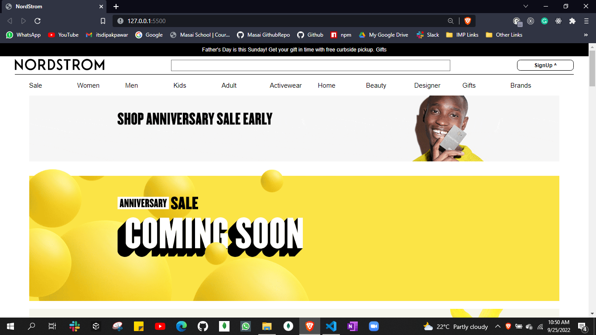
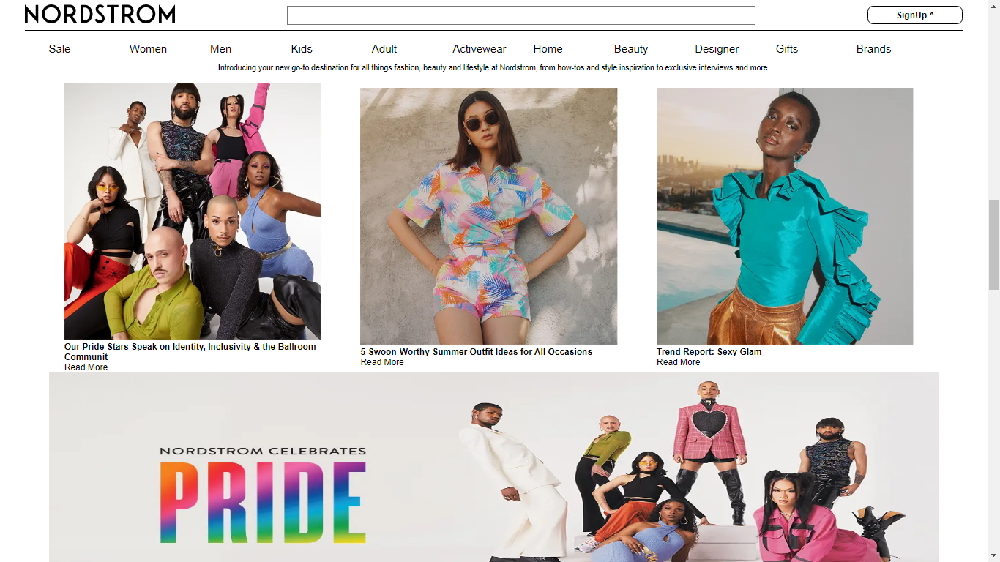
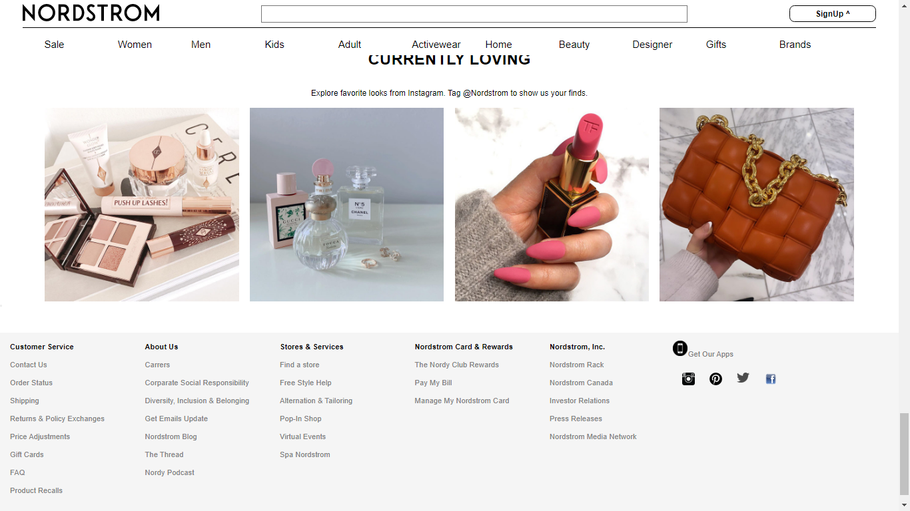
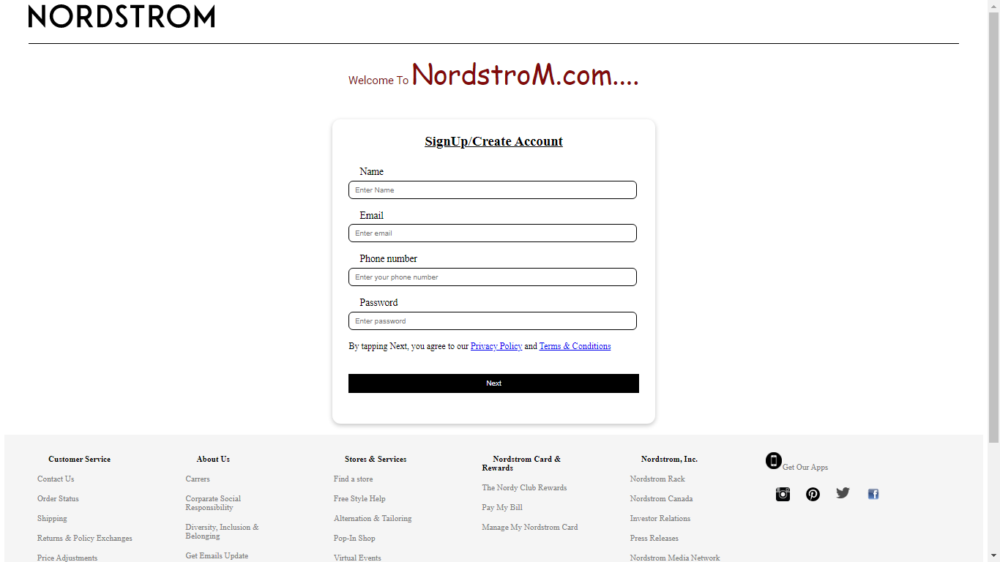
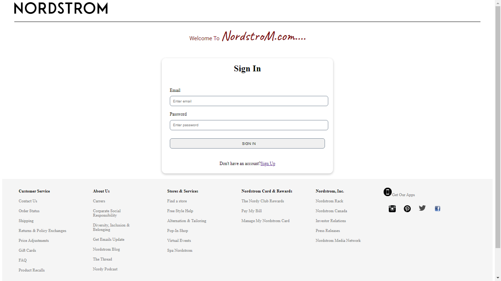
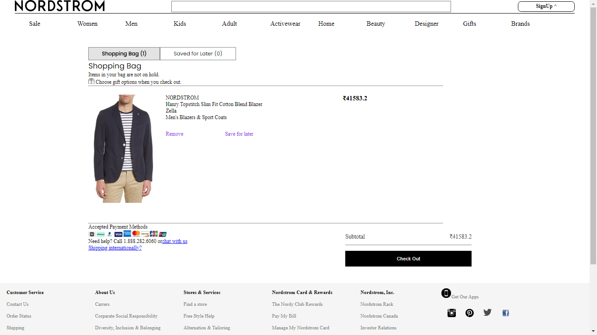
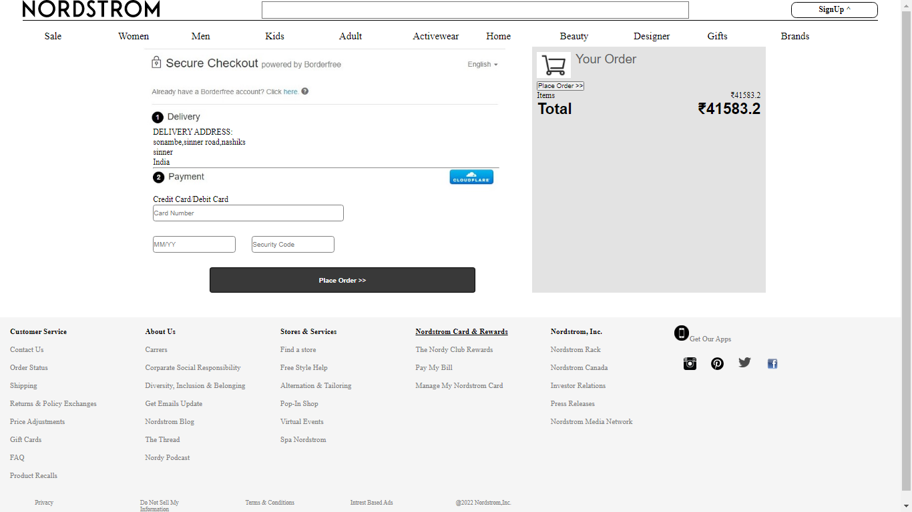
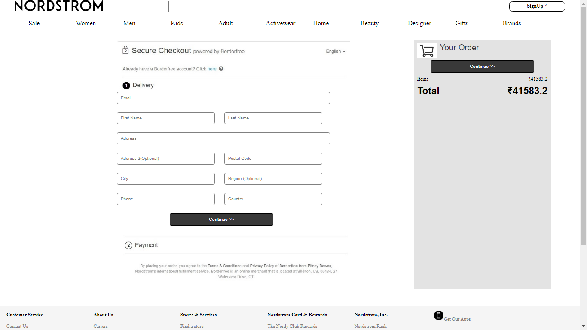

# Nordstrom.com (clone)

Nordstrom.com is a new kind of shopping comparison site that offers the most comprehensive shopping experience on the web. It is the best collection of the stores you can't live without, and the brands and products you love - all in one place.

## Contributors

- [Abhishekh Rawat](https://www.github.com/octokatherine)
- [Dipak Pawar](https://www.github.com/octokatherine)
- [Sourav Kumar Sinha](https://www.github.com/octokatherine)
- [Shivaji Jadhav](https://www.github.com/octokatherine)

## Features

- When user will be able to browse and buy the products with smooth experience.

- Our homepage has been designed along with different categories that makes our homepage userfriendly, and our customer can easily find in what caetegory they want to shop.
- At the navbar our customer can easily browse the product's page, also they will be able to go to their cartpage, signin and signup page.
   On signup page user can easily create their account by giving Only G-mail and mobile no. and after successfull creation of account they will get an option for signin at welcome page.
- Product page is easy to browse, They can sort the category, add to their cart and also get a button of buying option that goes directly to cart page.
  After adding items in the cart all the items price will get added and also can change the quantity of the item and can easily proceed for checkout.
  At the payment page customer can easily choose any card for checkout.

- After successfull transaction they can see their payment details at afterpaymentpage.
## Homepage

## Signup/Sign In pages

## Checkout-Add to Cart

